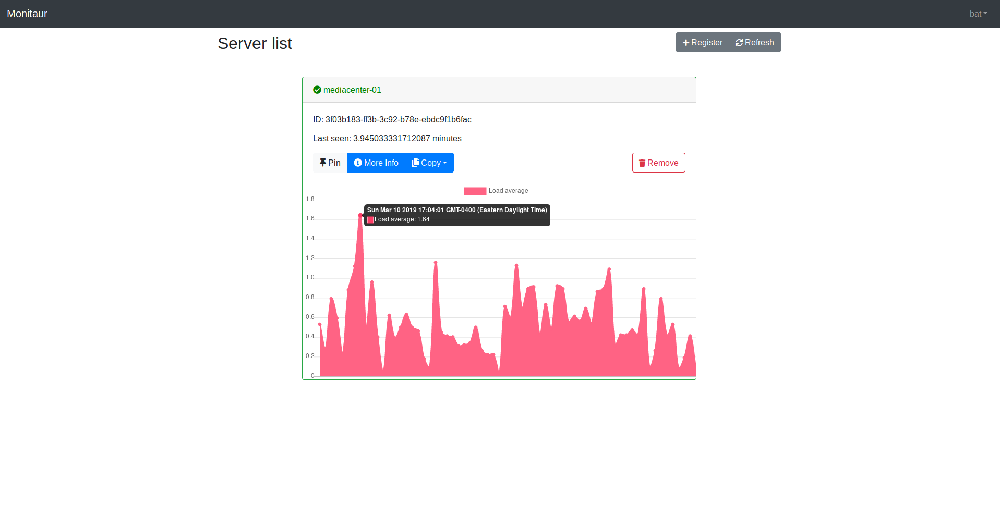
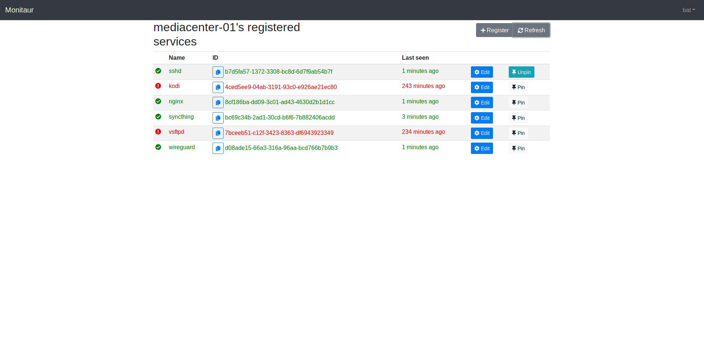

# py-monitaur

A simple monitoring application reversing probes from server to client.

Look at the examples directory for an idea on how to use it.

## Running on linux

```
$ git clone ...
$ python3 -m venv venv
$ . venv/bin/activate
$ pip install flask
$ FLASK_APP=app FLASK_ENV=production flask run
```

Substitute `FLASK_ENV=production` for `FLASK_ENV=dev` for development purposes.

Follow [Flask's documentation](http://flask.pocoo.org/docs/1.0/installation/#installation) for platform specific instructions.

## Reverse proxying example

Using nginx

```
server {
    # Other config

    server_name monitaur.domain.com;

    location / {
        proxy_pass http://localhost:5000;
        proxy_buffering off;
    }
}
```

## Screenshots


